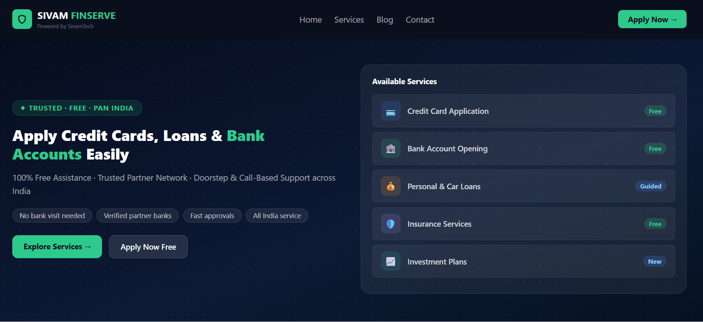

# Sivam Finserve – Financial Service Web Platform

Sivam Finserve is a web-based platform designed to simplify access to financial services such as credit cards, loans, bank accounts, and insurance. The goal of this project is to provide a clean and guided user experience for individuals who want to explore and apply for financial products without confusion.

---

## Overview

This project is inspired by real-world fintech and DSA (Direct Selling Agent) models. It focuses on helping users understand available financial options and apply through a structured and user-friendly interface.

The platform highlights trust, simplicity, and accessibility while maintaining a modern UI design.

---

## Features

* Credit card exploration and application interface
* Personal and vehicle loan information with eligibility guidance
* Bank account opening assistance
* Insurance and investment service sections
* Step-by-step “How it Works” flow for users
* Featured offers section with benefits and eligibility
* Call-to-action sections for lead generation
* Mobile responsive design

---

## Design Approach

The UI is designed using a clean and minimal SaaS-style layout.
Focus areas during development:

* Clear visual hierarchy
* Simple navigation
* Conversion-focused sections
* Trust-building elements like disclaimers and service highlights

The design ensures that even a non-technical user can easily understand and navigate the platform.

---

## Tech Stack

* HTML5
* CSS3
* Responsive Grid Layout
* Custom styling (no external UI frameworks used)

---

## Use Case

This project can be used as a base for:

* Financial service lead generation platforms
* DSA or loan agent business websites
* Affiliate-based fintech systems
* Customer onboarding portals

---

## Future Improvements

* EMI calculator integration
* Basic chatbot for user queries
* Form-based lead capture system
* Backend integration for storing user data
* API integration with financial service providers

---

## About the Project

This project was built as part of practical learning and to understand how real-world financial service platforms work. It reflects both technical implementation and business thinking.

---

## Author

Manoj Kumar Jena
Location: Bengaluru
Experience: 3.8 years

---
## Project Preview

Main landing page of the platform showing services and offers.

## Note

This is a frontend concept project. Final approval of any financial product depends on the respective banks and institutions.

---
